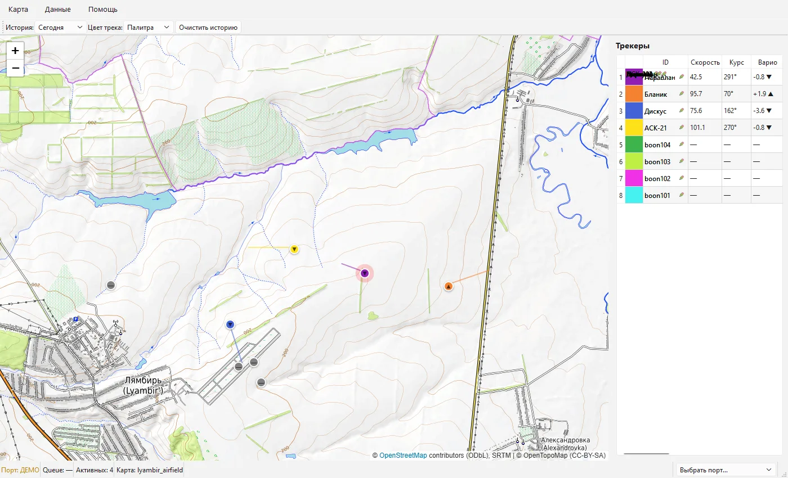
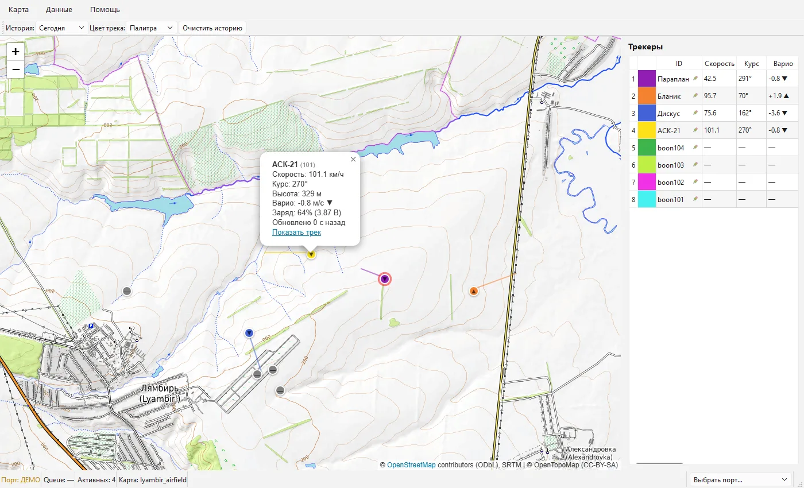
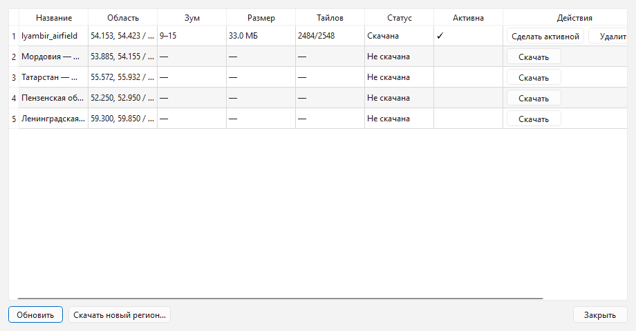

# MeshTrack Desktop

[](LICENSE)
[](#system-requirements)
[](tests/)

An offline desktop application for live tracking of gliders, paraglider and
hang glider pilots — an auxiliary component of the **AGLoRa** ecosystem (see
below). **MeshTrack Desktop** reads packets from a LoRa gateway receiver over
USB-serial and shows positions on a local topographic map (Leaflet in
QtWebEngine) with course, altitude and climb/sink trend. Position history is
stored in SQLite.

Works **fully offline**: the only network activity is a one-time map download on
first run and an optional upload of positions to Traccar (disabled by default).

> MeshTrack Desktop is an **auxiliary application**: on its own it is useless
> without a USB receiver. You can try the interface in the demo mode (no
> hardware) — it shows how the program will work.

## About the AGLoRa ecosystem

MeshTrack is a further, more professional development of the
**[AGLoRa](https://github.com/Udj13/AGLoRa)** project — a GPS tracking system
for objects (primarily pilots), which includes:

- **trackers** — with their own firmware, but not only (Meshtastic devices are
  also supported);
- **gateways** — LoRa receivers attached to a computer via USB;
- **backend** — for the online usage variant.

The project is published **in parts** — not all modules are fully tested yet.

**MeshTrack Desktop** is designed for the fully offline usage variant: the user
downloads maps of a region once, plugs a gateway receiver into the computer via
USB and then works completely autonomously, without an internet connection.

## Screenshots

| Map with trackers | Tracker position |
|---|---|
|  |  |

"Map management" dialog:



## Features

- Multiple trackers at once, each with its own color from the palette, course
  and altitude.
- Live track of every pilot with a climb/sink (variometer) indicator.
- Click popup: speed, altitude, battery, "Updated" time, RSSI/SNR.
- SQLite history with retention; tracks and trackers are restored on start.
- Local maps in MBTiles format (OpenTopoMap): map download in the first-run
  wizard, works without the internet.
- Track export to **GPX / CSV**.
- Russian and English UI (based on system locale).
- Demo mode without hardware: see how the program works without connecting a
  receiver.
- Optional upload of positions to a **Traccar** server (disabled by default).

## System requirements

- **Windows 10/11 x64** — the only supported Windows platform. Windows 7/8/8.1
  are **not supported** (the Python 3.12 + Qt 6 / QtWebEngine stack cannot run
  on them).
- **macOS 12+** (Intel and Apple Silicon).
- **Linux** — run from source (no prebuilt installers for Linux yet). Requires
  QtWebEngine system packages (`libnss3`, `libxcb-*`, `libgbm1`, `libasound2`,
  etc.) and read access to `/dev/ttyUSB*` (`dialout` group).
- USB-UART driver for the AGLoRa gateway receiver (CP2102 and similar).
- Prebuilt installers are distributed only for **Windows** (`.exe`) and
  **macOS** (`.dmg`).

## Installation

Download a single installer `MeshTrackSetup-<version>.exe` from
[Releases](https://github.com/Udj13/meshtrack-desktop/releases) and run it.

> No code signing: when launching the installer choose "More info → Run anyway"
> (SmartScreen) or "Open" from the right-click menu.

The first run launches a wizard: choose the language, download the region map
(once), connect the receiver.

## Run from source

Requires Python 3.11+.

```bash
python -m venv .venv
.venv\Scripts\activate              # Windows
source .venv/bin/activate           # macOS / Linux
pip install -r requirements.txt
python -m meshtrack                 # run the application
python -m meshtrack --demo          # demo mode with mock data (no receiver)
```

To read data from a real receiver, connect a USB-UART adapter (CP2102 and
similar), then choose the port and baud rate 115200 in the settings.

## Tests

```bash
pytest -q    # 190+ tests; none require GUI
```

## AI-assisted development

This project (including part of the code, documentation and tests in this
repository) is developed with the help of AI assistants (e.g. opencode — an
LLM-based assistant). AI helps generate and refactor code and write
documentation and tests; all code is reviewed by a human and covered by pytest
tests (190+), run with `pytest -q`.

Important: **AI is not used to run the application.** MeshTrack is fully
offline — telemetry, maps and history never leave the computer and are not sent
to any AI services.

## Build

Windows: PyInstaller (onedir) + Inno Setup 6 → a single `.exe` installer.
macOS: PyInstaller → `.app` → DMG. Full instructions and pitfalls are in
`PROJECT.md §12`.

```bash
# Windows
.venv\Scripts\python.exe -m PyInstaller --noconfirm installer/win/MeshTrack.spec
"${LOCALAPPDATA}\Programs\Inno Setup 6\ISCC.exe" installer/win/setup.iss
```

## Repository structure

```
meshtrack/        core application modules (see AGENTS.md)
assets/web/       map frontend (Leaflet, JS bridge)
assets/licenses/  full third-party license texts
installer/        PyInstaller spec + Inno Setup / DMG scripts
tests/            pytest tests (no GUI)
tools/            helper utilities (demo data, map download, screenshots)
docs/screenshots/ README screenshots
```

## Documentation

- `PROJECT.md` — full architecture, data formats, command part (source of truth).
- `AGENTS.md` — project overview for development/agents.

## Licenses

The project code is licensed under the **MIT** license — see `LICENSE`.

Third-party components shipped with the application and their licenses:

| Component | License |
|---|---|
| MeshTrack Desktop (project code) | MIT |
| PySide6 / Qt 6 (incl. QtWebEngine) | LGPL-3.0 |
| Python (embedded in the build) | PSF-2.0 |
| requests | Apache-2.0 |
| pyserial | BSD-3-Clause |
| Leaflet | BSD-2-Clause |
| PyInstaller (build-time only) | GPL-2.0-or-later + bootloader exception |
| OpenStreetMap data | ODbL-1.0 |
| OpenTopoMap tiles | CC-BY-SA-3.0 |

Full texts are in `assets/licenses/`; in the app: "Help → Component licenses".
OSM/OpenTopoMap attribution is also shown on the map.